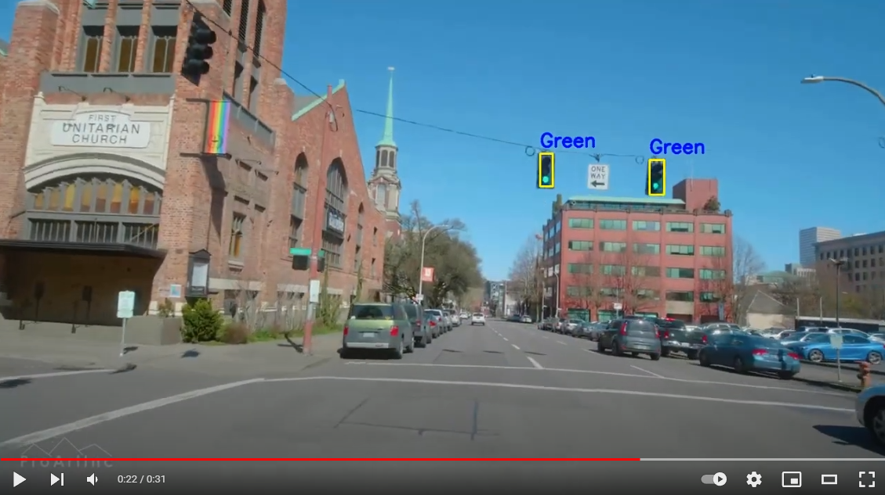
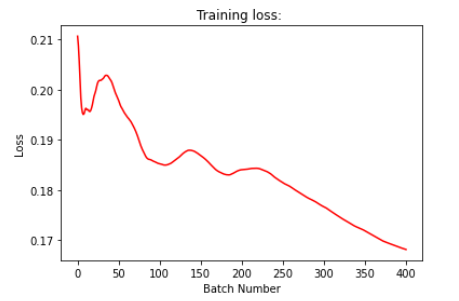
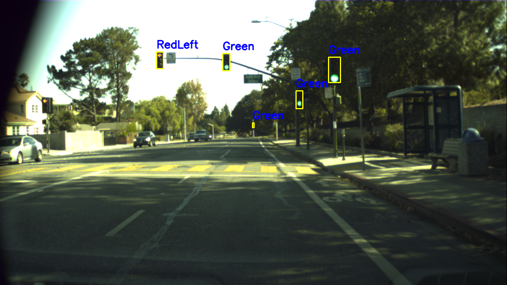
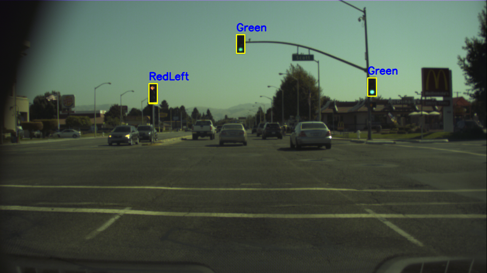

# Abstract 

Traffic light detection has always been crucial to the safety of self-driving cars. Autonomous vehicle and smart cities must detect traffic light to function. And detecting traffic lights can be done both as a classification problem, where a neural network simply tries to detect the presence of traffic light. Or it can be much more sophisticated as a multiclass object detection problem. We have taken the latter approach and designed and trained a fully end-to-end deep neural network to detect and classify 12 different types of traffic light signals. Our network have demonstrated real-time performance on a laptop with a RTX2080, and can achieve a high F1 score on 6 GBs of test video. 

# Videos

The following video is our Faster-RCNN object detector trained on 5000 annotated traffic light labels. The detection was ran on a video extracted from a random youtube clip.

[](https://www.youtube.com/watch?v=4zXyJWrQRM0-Y "Everything Is AWESOME")

Next is our presentation video (please click on the thumbnail)

[](https://youtu.be/LFBUFx0beLU-Y "Everything Is AWESOME")


# Problem Statement
Solving the traffic light problem for autonomous vehicles is critical for all vehicle safety, not just autonomous vehicles. The lack of accurate traffic light detection system could pose a serious threat to safety to both drivers and pedestrians. An accurate and efficient vision-based detection system is a necessary and vital step toward bringing autonomous vehicles to the streets. Our goal is to detect a bounding box for each traffic light in the image and also there corresponding labels. We want to detect the difference between a left-turn arrowed red light and a normal green light. 

# Data description
This dataset contains 13427 camera images at a resolution of 1280x720 pixels and contains about 24000 annotated traffic lights. The annotations include bounding boxes of traffic lights as well as the current state (active light) of each traffic light.

The camera images are provided as raw 12bit HDR images taken with a red-clear-clear-blue filter and as reconstructed 8-bit RGB color images. The RGB images are provided for debugging and can also be used for training. However, the RGB conversion process has some drawbacks. Some of the converted images may contain artifacts and the color distribution may seem unusual.


## Training set: 
* 5093 images
* Annotated about every 2 seconds
* 10756 annotated traffic lights
*  Median traffic lights width: ~8.6 pixels
* 15 different labels
* 170 lights are partially occluded

## Test set: 
* 8334 consecutive images
* Annotated at about 15 fps
* 13486 annotated traffic lights
* Median traffic light width: 8.5 pixels
* 4 labels (red, yellow, green, off)
* 2088 lights are partially occluded


# Methodology 

The model of we chose for this project is the **Faster R-CNN** model we discussed heavily in class and the backbone is the **ResNet-50**. Since our goal is to detect objects location in real time, the Faster R-CNN helps us elimniate the threat of bottlenck for any advance computation and provides accurate prediction. Additionally, since we have a lot of classes as our labels, we decided to use a fairly deep feature extrator, a 50 layer convolutional network as the backbone of the model. ResNet-50 provides an excellent tool with the ability to classifiy images to more than 100 classes which fits perfectly with the task in hand. Our approach heavily relied on **transfer learning** where we used the resnet backbone that is pretrained on ImageNet. It is a popular approach in deep learning where pre-trained models are used as the starting point on computer vision and natural language processing tasks given the vast compute and time resources required to develop neural network models on these problems and from the huge jumps in skill that they provide on related problems. It offers an optimization that allows rapid progress or improved performance when modeling the second task which is what we need when processing a deep, enormous dataset like this one.

# Evaluation

The evaluation on our predictions, or the measure of accuracy of our prediction is difficult to define as it contains many components for a complex task as object detection. First, we defined IOU. Intersection over Union is an evaluation metridc used to measure the accuracy of an annotation on a particular task. In our case it's the precision of the box when compared against to the ground truth. When comparing the boxes in the predictions and in the ground truths, we check every combination of the boxes and seek two pieces of data, the area of intersection or overlap between the two regions and the union of the two areas. 
<br />
```IOU = Area of Intersection / Area of Union ```
<br />
Basically, the the closer the IOU is to 1, the more closely related the two annotations are. In combination with the labels of the boxes, we can get 2 very different measures for a single sample. First let's define some terinologies. <br />
```True Positive(TP): Correctly drawn annotations. Meaning the label of the prediction matches the respective label in the ground truth. ```
<br />
```False Negative(FN): Annotation not present in the prediction but the label exists in the ground truth.```
<br />
```False Positive(FP): There are incorrectly drawn annotation```
<br />

With these three parameters we could easily calculate the overall accuracy of a single prediction, the correctly labeled annotations divided by the total boxes. However, the simplicity of the accuracy only entails the ratio of correctly drawn annotation compared to total boxes is often not enough to justify the measurement of quality of the model. What if there is a severe class imbalance and leas to a significant count of FNs instead of FPs. Results like this could lead to bias or incorrect conclusion of the quality of a sample. 

Which is why we offer two new measurements, **Precision and Recall**.
<br /> ```Precision = TP / (TP + FP) ```.
<br /> ```Recall = TP / (TP + FN) ```
<br /> Precision is the ratio of correctly drawn boxes to the total number of drawn boxes. And recall is the ratio of correctly drawn annotation to total number of ground truth annotation. These two measurements entails more characteristics about FNs and FPs seperately. 

# Results

Below is our training lost curve, we trained for 8 epochs, with 5093 images, and a batch size of 1. It took about 8 hours running on my laptop with a RTX2080. The loss curve is decreasing pretty consistently. We believe that if we let it train for longer, it can probably do better on our test dataset. We used Adam optimizer and a learing rate scheduler for faster convergence. 



Using a confidence threshold of 0.5, our average recall and precision were **0.5431** and **0.4292** respectively on our test dataset consisting of 8334 images. This is to be expected as our training dataset is quite small and we only trained for 8 epochs. Future improvements will include training for a longer time using a larger dataset. And we also need to add some data augmentation such as flip and scale. 

# Examples Images:

Below are some example prediction on our test dataset.



